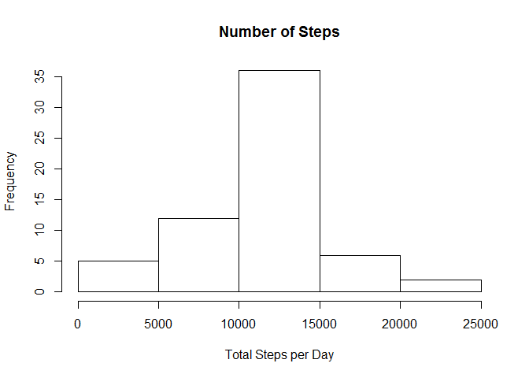

# Reproducible Research: Peer Assessment 1
---
output: html_document
---
# Reproducible Research: Peer Assessment 1


## Loading and preprocessing the data

```r
data <- read.csv("activity.csv")
```


## What is mean total number of steps taken per day?

```r
total <- tapply(data$steps,data$date,sum)

hist(total,main = "Number of Steps", xlab = "Total Steps per Day", 
     ylab = "Frequency")
```

 

```r
mean(total,na.rm=T)
```

```
## [1] 10766
```

```r
median(total,na.rm=T)
```

```
## [1] 10765
```

## What is the average daily activity pattern?


```r
intervals <- as.numeric(labels(split(data$interval,data$interval)))
plot(intervals,tapply(data$steps,data$interval,mean, na.rm = T),
     type = "l",xlab = "Interval",ylab = "Mean Number of Steps")
```

 

Interval 835 has the maximum number of average steps, about 206. 

```r
avg <- tapply(data$steps,data$interval,mean,na.rm=T)
avg[avg == max(avg)]
```

```
##   835 
## 206.2
```

## Imputing missing values


```r
date.nas <- is.na(data$date)
intv.nas <- is.na(data$interval)
steps.nas <- is.na(data$steps)

NAs <- data.frame("Total Date NAs" = sum(date.nas), 
                  "Total Interval NAs" = sum(intv.nas),
                  "Total Step NAs" = sum(steps.nas))

print(NAs)
```

```
##   Total.Date.NAs Total.Interval.NAs Total.Step.NAs
## 1              0                  0           2304
```

```r
data$steps[is.na(data$steps)] <- with(data, ave(steps, interval, 
              FUN = function(x) mean(x, na.rm = T)))[is.na(data$steps)]

sum(is.na(data$steps))
```

```
## [1] 0
```

```r
total <- tapply(data$steps,data$date,sum)

hist(total,main = "Number of Steps", xlab = "Total Steps per Day", 
     ylab = "Frequency")
```

 

```r
mean(total)
```

```
## [1] 10766
```

```r
median(total)
```

```
## [1] 10766
```


## Are there differences in activity patterns between weekdays and weekends?


```r
data$days <- weekdays(as.Date(data$date))

data$day.type <- ifelse((data$days == 'Saturday' | data$days == 'Sunday'),
                        'weekend','weekday')
data$day.type <- factor(data$day.type)

avg <- aggregate(steps ~ interval + day.type, data = data, FUN= "mean" )

library(lattice)
xyplot(steps ~ interval|day.type, data = avg, type = 'l',layout = c(1,2))
```

 
